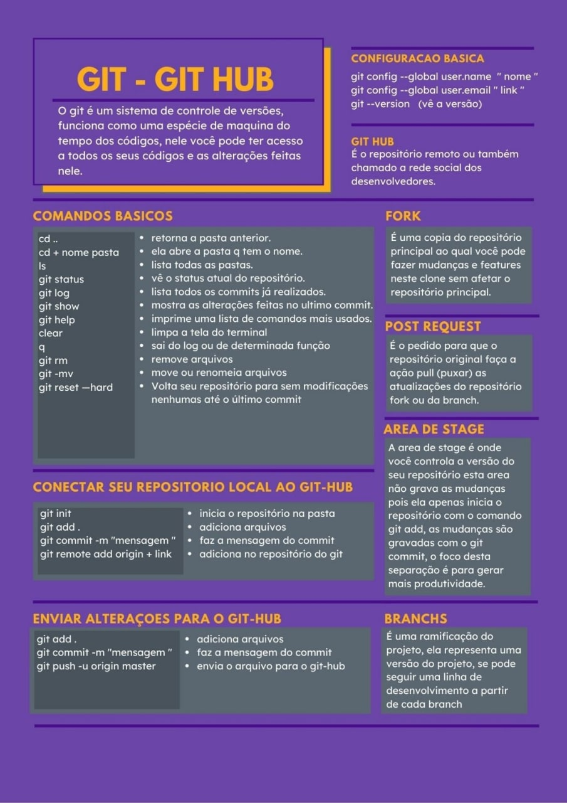

## Oque é GIT
oque é o git: sistema descentralizado de controle de versão distribuido. que significa ter o codigo fonte em outras maquinas e todos conseguem contribuir com o desenvolvimento.
ferramentas que usam git.
- GITHUB - projeto open-sourch.
- BITBUCKET - plataforma mais empresarial, possivel conexão com outras ferramentas.
- GITLAB- proprio servidor git, mais privado, mais modelavel.

Dowload do git em : https://git-scm.com/downloads

## Init, Add e commit

### Init
inicie o gitbash, execute o primeiro comando:

Esse comando será responsavel por inicializar o versionamento, e indicar o caminho onde a pasta git esta.
```sh
git init
Reinitialized existing Git repository in C:/Users/maira/git/.git/
```

Crie um arquivo na pasta git.

- i para inserir
- esc para sair do modo
- :wq para salvar

```sh
vi nomedoarquivo
```

### Git Add

Só criar um arquivo não é suficiente, é necessario o git reconhecer o arquivo para criar snapshots dele.
Então o comando a seguir é para adicionar/identificar o arquivo no git.

```sh
git add nomedoarquivo
```


### Git commit

Depois é necessario criar um commit do arquivo, que nada mais é do criar uma linha do tempo para o arquivo e suas versões que viram a seguir.
O comando a seguir marca a linha do tempo.
```sh
git commit -m "A mensagem que deseja registrar"
```

Para verificar oque aconteceu com esse arquivo em outro momento.
- mostra o autor
- a data da alteração.

```sh
git log
```

Verificação no git de alteração de arquivos.
- onde voce esta (pasta)
- quais arquivos foram alterados e adicionados

```sh
git status
```
Para adicionar todos os arquivos no git use o comando.
```sh
git add .
```


## Log, status e show


BRANCH - Ramificação de uma linha temporal, existem uma serie de commits que é o master, mas os branchs são ramificações a mais.
Pastas a mais no repositorio principal que é o master.

### Criando uma branch

Para criar uma branch use o comando seguido do nome do repositorio.
```sh
git branch feature/nomedapasta
```

### Acessando uma branch

Para acessar a branch criada, ou o novo repositorio dentro do principal master() Use
```sh
git checkout feature/nomedapasta
```

Para remover um arquivo do git Use
```sh
git reset
```
Para retornar ao diretorio raiz, Use
```sh
git checkout master
```

O comando **git log** vai exibir apenas os commits realizados dentro de cada pasta, então na pasta raiz não sera possivel observar os commits realizados nas sub pastas.

Os commits exibem uma hash de identificação, se utilizar o comando a seguir + a hash do commit, exibira mais informações sobre as modificações do arquivo.

```sh
git show 8ca012eede2dc0446363c6cdb191e5b1e09bd6e4
```
Para listar as branchs existentes no repositorio Use
```sh
git branch
```

Para excluir uma branch use o comando.
```sh
git branch -D feature/nomedapasta
```


## Branch, checkout merge e push

Crie um projeto no github,
e para adicionar o projeto na maquina local utilize o comando informado pelo github para adicionar o repositorio em uma conta ja existente.

- obs: o main pode variar, pois cada repository é adicionado com um nome, as vezes pode ser master.
```sh
$ git remote add origin https://github.com/M41R40/gama-no-github.git
```

Para submeter o arquivo para o repositorio criado use:
```sh
git push --set-upstream origin
```
> origin é o nome da branch

Se não funcionar utilize o comando para atualizar o repositorio, com a linha html fornecida em codigo no github referente ao repositorio que deseja se conectar :
```sh
$ git pull https://github.com/M41R40/gama-no-github.git feature/gama-no-github
```
Se estiver ocorrendo problemas com as conexões remotas, visualize quais existem já com o comando o qual ira listas as conexões remotas existentes a diretorios.

```sh
git remote -v
```
Para excluir uma conexão remota indesejada use o comando.
```sh
git remote rm nomedaconexão
```
> em muitos casos o nome da conexão pode ser origin, ou feature, master ou main.

Assim que apagadas as conexões indesejadas, repita o comando git remote add com o link do repositorio que deseja se conectar, disponivel na pagina do github na opção codigo. Depois adicione o arquivo com o git add, depois commita o arquivo, depois use o git push --set-upstream origin, lembrando que origin pode variar com o nome que escolheu para a conexão remota.

Por fim o comando merge é importante se tiver varias branch's, ele serve para unificar todas as branch's e fazer update dos arquivos para a main principal.

```sh
git merge feature/nomedabranch
```


## Clone e pull
### Recuperando um repositório.
Suponhamos que sem querer foi deletado uma pasta importante da sua area de trabalho, como recuperar os arquivos?

Bom, se ela estiver commitada no seu github é só usar o comando clone.

La no github no projeto que deseja clonar(copiar) vá ate a opção codigo, na opção html, copie o link e cole depois do comando.
```sh
git clone https://github.com/M41R40/teste.git
```
### Criando uma branch e logando.
Para criar uma branch e já se logar nela sem usar 2 comandos use:

```sh
git checkout -b altconf
```

## Ignore

É comum em parte de projetos que não se deseja compartilhar.
São arquivos .gitignore


## Pull Request

### Fork
É uma divisão do projeto original que é possivel sofrer alteração sem afetar o projeto original,
nada mais é do que clonar, e depois dar um pull request. Que é contribuir com o projeto.


## Gitflow
Gitflow é o entendimento da estrutura do git, as branchs. Uma divisão de camadas. Dando proteção aos codigos que estão em branch MASTER, e dando permissão de edição em uma outra branch para criação de codigos fontes.

Imagem = 
